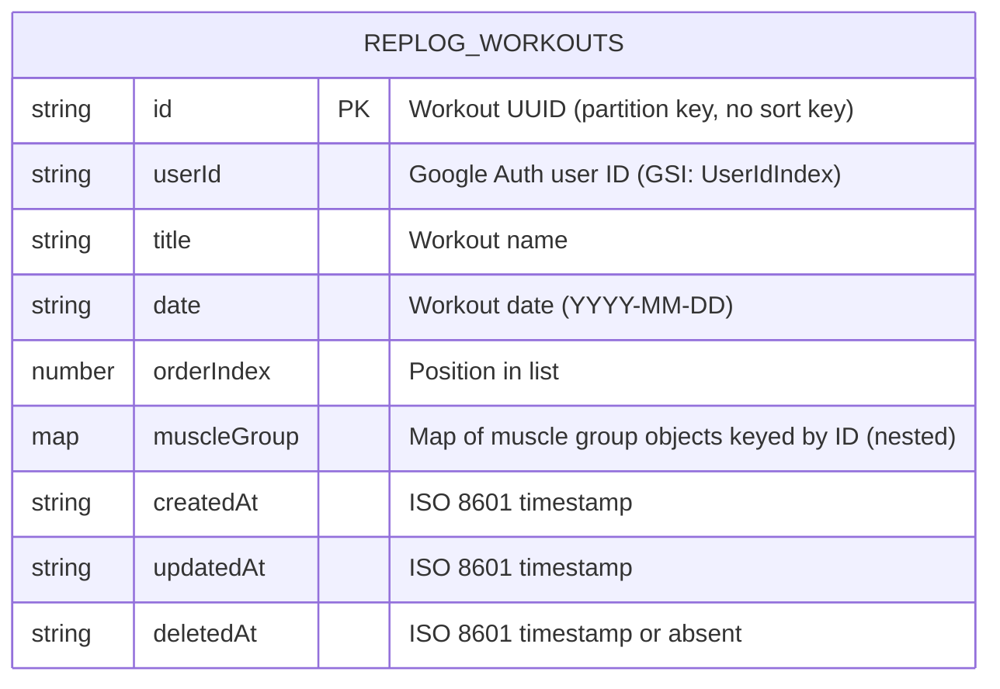
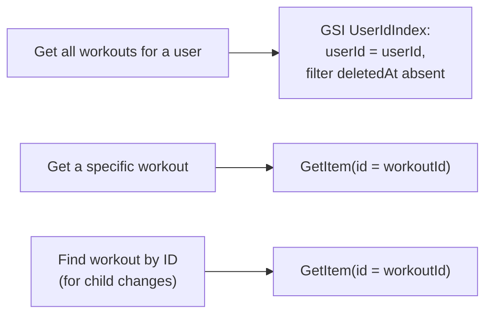
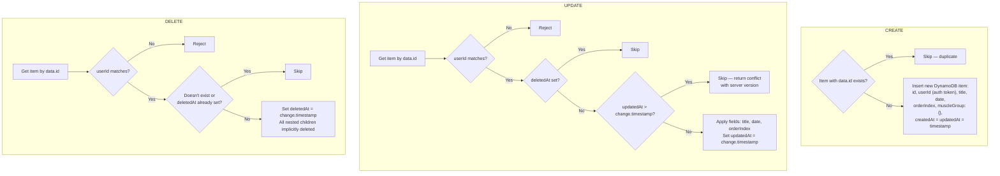
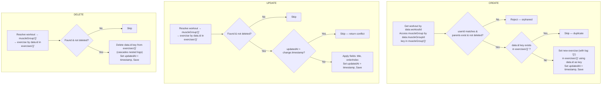
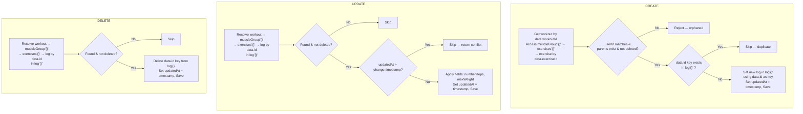
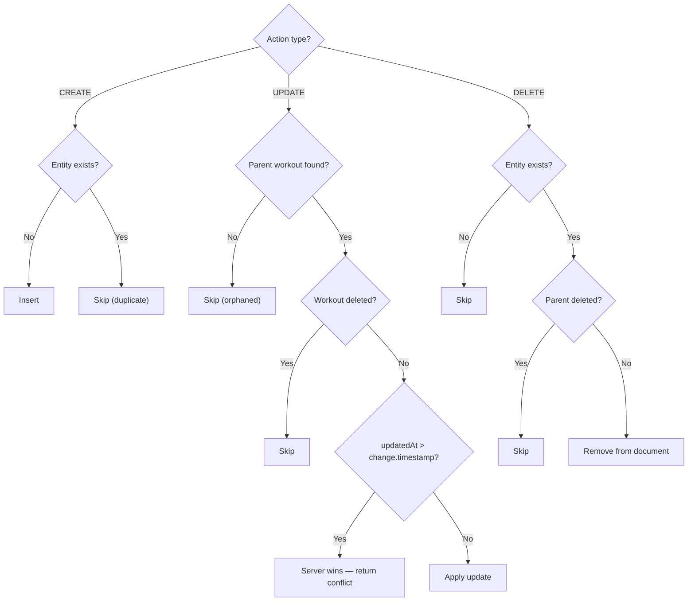

# RepLog Backend — Sync API

Backend specification for the RepLog sync system. This API receives change events from the client, applies them to the database with conflict resolution, and returns the current state for the client to merge.

## Table of Contents

1. [Overview](#1-overview)
2. [Data Model (DynamoDB)](#2-data-model-dynamodb)
3. [API Endpoints](#3-api-endpoints)
4. [Entity Processing](#4-entity-processing)
5. [Conflict Resolution](#5-conflict-resolution)
6. [Authentication & Authorization](#6-authentication--authorization)
7. [Security](#7-security)

---

## 1. Overview

### What the backend does

- Receives batches of change events (create, update, delete) from the client
- Applies them to the database, resolving conflicts with last-write-wins
- Returns the current state as nested `WorkOutGroup[]` for the client to merge
- Manages sync metadata (`createdAt`, `updatedAt`, `deletedAt`) — the client does not track these
- Serves as the source of truth for cross-device consistency

### What the backend does NOT do

- Real-time sync (WebSockets, SSE) — sync is pull-based
- Multi-user collaboration — this is a single-user personal app
- Client state management — the client manages its own IndexedDB and sync queue

### Design Principles

- **Idempotent push** — replaying the same change is safe (CREATE skips duplicates, UPDATE uses timestamp comparison, DELETE checks `deletedAt`)
- **Last-write-wins** — conflicts are resolved by comparing timestamps, no user intervention needed
- **Cascading deletes** — deleting a workout deletes all its children
- **Document storage** — each workout is stored as a single DynamoDB item containing the full nested structure (muscle groups, exercises, logs) as maps keyed by entity ID, enabling O(1) lookups and direct key access for mutations

---

## 2. Data Model (DynamoDB)

### 2.1 Table: `replog-workouts`

Each item is a workout document, keyed by the workout's UUID.

#### Key Schema & Item Schema

The workout item stores the entire nested structure as a single document.



The `muscleGroup` attribute contains the full hierarchy:

```json
{
  "id": "w-uuid-1",
  "userId": "google-123",
  "title": "Push Day",
  "date": "2026-02-25",
  "orderIndex": 0,
  "muscleGroup": {
    "mg-uuid-1": {
      "id": "mg-uuid-1",
      "workoutId": "w-uuid-1",
      "title": "Chest",
      "date": "2026-02-25",
      "orderIndex": 0,
      "exercises": {
        "ex-uuid-1": {
          "id": "ex-uuid-1",
          "muscleGroupId": "mg-uuid-1",
          "title": "Bench Press",
          "orderIndex": 0,
          "log": {
            "log-uuid-1": {
              "id": "log-uuid-1",
              "numberReps": 10,
              "maxWeight": 80,
              "date": "2026-02-25T10:00:00.000Z"
            }
          }
        }
      }
    }
  },
  "createdAt": "2026-02-25T10:00:00.000Z",
  "updatedAt": "2026-02-25T10:05:00.000Z"
}
```

> **Why maps instead of arrays?** Storing nested entities as maps keyed by entity ID provides O(1) lookup by ID (instead of O(n) array scan), enables direct DynamoDB update expressions (e.g., `muscleGroup.#mgId.title`), and simplifies CREATE/UPDATE/DELETE operations to direct key access and deletion. The `GET /api/sync/pull` endpoint transforms maps back to arrays before responding, so the client-facing format is unchanged.

### 2.3 Access Patterns



### 2.4 DynamoDB Item Size

DynamoDB has a 400 KB item size limit. A workout with 10 muscle groups, each with 10 exercises, each with 50 logs, fits well within this limit. If a workout ever approaches the limit, it would mean thousands of logs — unlikely for a workout tracker.

---

## 3. API Endpoints

All endpoints require authentication. The `userId` is extracted from the auth token — never from the request body.

### 3.1 `POST /api/sync/push`

Receives a batch of changes from the client and applies them.

**Request:**

```json
{
  "changes": [
    {
      "id": "change-uuid",
      "entityType": "workout",
      "action": "CREATE",
      "timestamp": "2026-02-25T10:00:00.000Z",
      "data": {
        "id": "entity-uuid",
        "title": "Push Day",
        "date": "2026-02-25",
        "userId": "user-123",
        "orderIndex": 0
      }
    }
  ],
  "lastSyncedAt": "2026-02-24T20:00:00.000Z"
}
```

**Response (200 OK):**

```json
{
  "acknowledgedChangeIds": ["change-uuid-1", "change-uuid-2"],
  "conflicts": [
    {
      "changeId": "change-uuid-3",
      "resolution": "server_wins",
      "serverVersion": { "...entity fields..." }
    }
  ],
  "serverTimestamp": "2026-02-25T10:05:00.000Z"
}
```

**Response (409 — full re-sync needed):**

```json
{
  "error": "full_sync_required",
  "message": "Server state has diverged too much. Perform a full sync."
}
```

**Processing logic:**

1. Validate auth token, extract `userId`.
2. Validate request body schema.
3. Process each change sequentially (ordered by `timestamp`).
4. Apply each change to the database. Idempotency is inherent (duplicate CREATEs are skipped, UPDATEs use timestamp comparison, DELETEs check `deletedAt`).
5. Return acknowledged IDs, conflicts, and current server timestamp.

See [Section 4 — Entity Processing](#4-entity-processing) for details on how each entity type is handled.

### 3.2 `GET /api/sync/pull`

Returns all workouts for the authenticated user, as nested `WorkOutGroup[]`.

**Response (200 OK):**

```json
{
  "workouts": [
    {
      "id": "w-uuid",
      "title": "Push Day",
      "date": "2026-02-25",
      "userId": "user-123",
      "orderIndex": 0,
      "muscleGroup": [
        {
          "id": "mg-uuid",
          "workoutId": "w-uuid",
          "title": "Chest",
          "date": "2026-02-25",
          "orderIndex": 0,
          "exercises": [
            {
              "id": "ex-uuid",
              "muscleGroupId": "mg-uuid",
              "title": "Bench Press",
              "orderIndex": 0,
              "log": [
                {
                  "id": "log-uuid",
                  "numberReps": 10,
                  "maxWeight": 80,
                  "date": "2026-02-25T10:00:00.000Z"
                }
              ]
            }
          ]
        }
      ]
    }
  ],
  "serverTimestamp": "2026-02-25T12:00:00.000Z"
}
```

**Processing logic:**

1. Validate auth token, extract `userId`.
2. Query GSI `UserIdIndex`: `userId = <userId>`, filter `deletedAt` absent.
3. Strip internal attributes (`userId`, `createdAt`, `updatedAt`) from each item.
4. Transform each item's nested maps to arrays: convert `muscleGroup{}` to `muscleGroup[]`, each muscle group's `exercises{}` to `exercises[]`, and each exercise's `log{}` to `log[]`. Ordering is determined by `orderIndex` (for muscle groups and exercises) or insertion order (for logs).
5. Return the items as `workouts[]` in the nested `WorkOutGroup[]` array format expected by the client.

---

## 4. Entity Processing

All entity mutations resolve to reading and writing a workout document. Child entity changes (muscleGroup, exercise, log) require the backend to locate the parent workout, navigate to the nested object, apply the change, and save the updated document.

### Parent Workout Resolution

All child entity payloads include `workoutId`, enabling direct lookup of the parent workout document.

- **muscleGroup**: `data.workoutId` → direct `GetItem` by partition key.
- **exercise**: `data.workoutId` → direct `GetItem`, then access muscle group by `data.muscleGroupId` key in `muscleGroup{}`.
- **log**: `data.workoutId` → direct `GetItem`, then access muscle group by `data.muscleGroupId` key in `muscleGroup{}`, then access exercise by `data.exerciseId` key in `exercises{}`.

### 4.1 Workout



**CREATE payload:**

```json
{
  "id": "w-uuid-1",
  "title": "Push Day",
  "date": "2026-02-25",
  "userId": "user-123",
  "orderIndex": 0
}
```

**UPDATE payload:**

```json
{
  "id": "w-uuid-1",
  "title": "Pull Day",
  "date": "2026-02-26",
  "orderIndex": 2
}
```

**DELETE payload:**

```json
{
  "id": "w-uuid-1"
}
```

### 4.2 Muscle Group

All operations fetch the parent workout document and modify the nested `muscleGroup{}` map.

```mermaid
flowchart TD
    subgraph CREATE
        C1["Get workout by data.workoutId"] --> C2{"userId matches &<br/>workout not deleted?"}
        C2 -->|No| C3["Reject — orphaned"]
        C2 -->|Yes| C4{"data.id key exists<br/>in muscleGroup'{}' ?"}
        C4 -->|Yes| C5[Skip — duplicate]
        C4 -->|No| C6["Set new muscle group in muscleGroup'{}'<br/>using data.id as key<br/>Set updatedAt = timestamp, Save"]
    end
    subgraph UPDATE
        U1["Get workout by data.workoutId"] --> U2["Access muscle group by<br/>data.id key in muscleGroup'{}'"]
        U2 --> U3{"Found & workout<br/>not deleted?"}
        U3 -->|No| U4[Skip]
        U3 -->|Yes| U5{"updatedAt > change.timestamp?"}
        U5 -->|Yes| U6["Skip — return conflict"]
        U5 -->|No| U7["Apply fields: title, date, orderIndex<br/>Set updatedAt = timestamp, Save"]
    end
    subgraph DELETE
        D1["Get workout by data.workoutId"] --> D2["Access muscle group by<br/>data.id key in muscleGroup'{}'"]
        D2 --> D3{"Found & workout<br/>not deleted?"}
        D3 -->|No| D4[Skip]
        D3 -->|Yes| D5["Delete data.id key from muscleGroup'{}'<br/>(cascades nested exercises and logs)<br/>Set updatedAt = timestamp, Save"]
    end
```



**CREATE payload:**

```json
{
  "id": "mg-uuid-1",
  "workoutId": "w-uuid-1",
  "title": "Chest",
  "date": "2026-02-25",
  "orderIndex": 0
}
```

**UPDATE payload:**

```json
{
  "id": "mg-uuid-1",
  "workoutId": "w-uuid-1",
  "title": "Back",
  "date": "2026-02-26",
  "orderIndex": 1
}
```

**DELETE payload:**

```json
{
  "id": "mg-uuid-1",
  "workoutId": "w-uuid-1"
}
```

### 4.3 Exercise

Operations get the parent workout by `data.workoutId`, access the muscle group by `data.muscleGroupId` key in `muscleGroup{}`, then operate on the `exercises{}` map.



**CREATE payload:**

```json
{
  "id": "ex-uuid-1",
  "workoutId": "w-uuid-1",
  "muscleGroupId": "mg-uuid-1",
  "title": "Bench Press",
  "orderIndex": 0
}
```

**UPDATE payload:**

```json
{
  "id": "ex-uuid-1",
  "workoutId": "w-uuid-1",
  "muscleGroupId": "mg-uuid-1",
  "title": "Incline Bench Press",
  "orderIndex": 2
}
```

**DELETE payload:**

```json
{
  "id": "ex-uuid-1",
  "workoutId": "w-uuid-1",
  "muscleGroupId": "mg-uuid-1"
}
```

### 4.4 Log

Operations get the parent workout by `data.workoutId`, access the muscle group by `data.muscleGroupId` key in `muscleGroup{}`, access the exercise by `data.exerciseId` key in `exercises{}`, then operate on the `log{}` map.



**CREATE payload:**

```json
{
  "id": "log-uuid-1",
  "workoutId": "w-uuid-1",
  "muscleGroupId": "mg-uuid-1",
  "exerciseId": "ex-uuid-1",
  "numberReps": 10,
  "maxWeight": 80,
  "date": "2026-02-25T10:00:00.000Z"
}
```

**UPDATE payload:**

```json
{
  "id": "log-uuid-1",
  "workoutId": "w-uuid-1",
  "muscleGroupId": "mg-uuid-1",
  "exerciseId": "ex-uuid-1",
  "numberReps": 12,
  "maxWeight": 85
}
```

**DELETE payload:**

```json
{
  "id": "log-uuid-1",
  "workoutId": "w-uuid-1",
  "muscleGroupId": "mg-uuid-1",
  "exerciseId": "ex-uuid-1"
}
```

### 4.5 Processing Summary

```text
1. Resolve the parent workout (using fields from data payload):
   - workout → lookup by data.id
   - muscleGroup → lookup workout by data.workoutId
   - exercise → lookup workout by data.workoutId, access muscleGroup by data.muscleGroupId key
   - log → lookup workout by data.workoutId, access muscleGroup by data.muscleGroupId key,
            access exercise by data.exerciseId key

2. Validate:
   - Workout exists and belongs to authenticated user
   - Workout is not soft-deleted
   - For child entities: parent node exists in the nested structure (key exists in parent map)

3. Check idempotency:
   - CREATE: skip if entity with same data.id key already exists in parent map
   - UPDATE: skip if workout.updatedAt > change.timestamp (return conflict)
   - DELETE: skip if entity key not found in parent map

4. Apply mutation:
   - CREATE: set in parent map using data.id as key
   - UPDATE: modify fields in-place (direct key access)
   - DELETE: delete key from parent map (cascades nested children)

5. Set workout.updatedAt = change.timestamp

6. Save the workout document back to DynamoDB
```

---

## 5. Conflict Resolution

### 5.1 Strategy: Last-Write-Wins (per workout)

Since the entire workout is stored as a single document, conflict resolution happens at the workout level. The version with the later `updatedAt` timestamp wins.

### 5.2 Rules



### 5.3 Conflict Response Format

```json
{
  "changeId": "change-uuid-3",
  "resolution": "server_wins",
  "serverVersion": {
    "id": "entity-uuid",
    "title": "Server Title",
    "date": "2026-02-25"
  }
}
```

---

## 6. Authentication & Authorization

### 6.1 Authentication

- All endpoints require a valid Google Auth JWT in the `Authorization` header: `Bearer <token>`.
- Validate the JWT against Google's public keys.
- Extract `userId` (Google `sub` claim) from the token.
- No user table or profile item needed — the `userId` from the JWT is stored as an attribute on each workout item.

### 6.2 Authorization

- **Push:** For CREATE, the backend sets `userId` from the auth token. For UPDATE/DELETE, the backend verifies `workout.userId` matches the authenticated user before applying changes.
- **Pull/Full:** GSI query uses `userId` from the auth token — only the user's own data is returned.

### 6.3 User ID Override

The backend **ignores** the `userId` field in client data and always derives it from the auth token.

---

## 7. Security

### 7.1 Transport

- All endpoints must be served over HTTPS.

### 7.2 Input Validation

- Validate all incoming fields against the expected schema (types, required fields, string lengths).
- Reject unknown `entityType` values.
- Reject changes with missing required fields.
- Sanitize text fields (titles) to prevent stored XSS.
- Maximum string lengths: `title` — 200 chars, `date` — 10 chars (YYYY-MM-DD).

### 7.3 Rate Limiting

- Max 10 sync requests per minute per user.
- Max 100 changes per push request.

### 7.4 Idempotency

Push is inherently idempotent — no separate tracking needed:

- **CREATE:** If the entity already exists, the change is skipped.
- **UPDATE:** Timestamp comparison ensures stale updates are rejected.
- **DELETE:** If already deleted (`deletedAt` set), the change is skipped.

### 7.5 Cleanup

- Periodically purge soft-deleted workout items older than a configurable threshold (e.g., 90 days).
