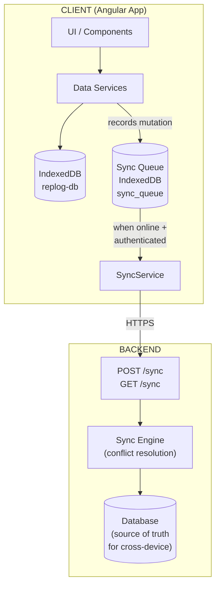
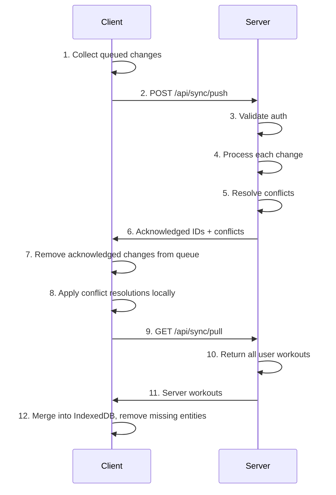
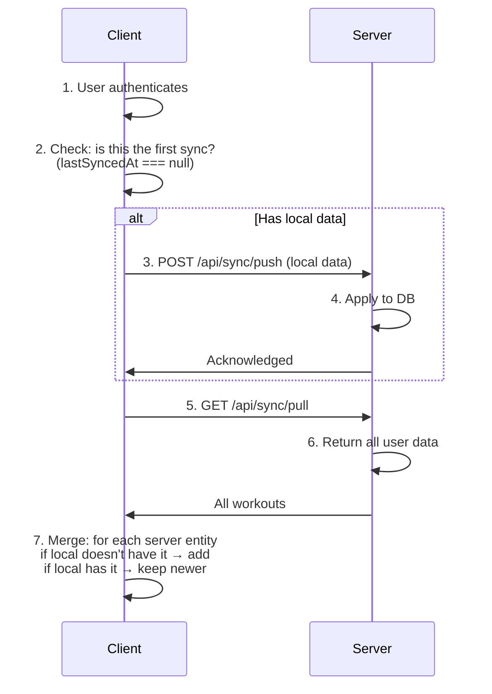

# RepLog Offline-First Sync Strategy

## Table of Contents

1. [Overview](#1-overview)
2. [Architecture](#2-architecture)
3. [Change Log (Sync Queue)](#3-change-log-sync-queue)
4. [Sync Service (Frontend)](#4-sync-service-frontend)
5. [Backend API Contract](#5-backend-api-contract)
6. [Conflict Resolution](#6-conflict-resolution)
7. [Sync Flows](#7-sync-flows)
8. [Edge Cases](#8-edge-cases)
9. [Migration Plan](#9-migration-plan)
10. [Security Considerations](#10-security-considerations)

---

## 1. Overview

RepLog is an offline-first workout tracking app. Users can create, edit, and delete workouts entirely offline. When a backend and authentication are added, users will be able to sync their local data with a remote database so they can access it from multiple devices.

### Strategy: Change Log with Last-Write-Wins

Instead of syncing the full current state, the app records **every mutation** (create, update, delete) as a change event in a local queue. When the app goes online and the user is authenticated, it pushes those changes to the backend, which applies them and returns the merged state.

### Design Principles

- **Offline is the default.** The app must work fully without a network connection. Sync is additive — it never degrades the offline experience.
- **IndexedDB is the local source of truth for the UI.** The UI always reads from IndexedDB. The backend is the source of truth for cross-device consistency.
- **Unauthenticated users are unaffected.** If a user never logs in, the app behaves exactly as it does today.
- **Sync is eventual.** There is no requirement for real-time sync. Changes are pushed when the app comes online.
- **No sync models on the client.** The existing UI models (`WorkOutGroup`, `MuscleGroup`, `Exercise`, `Log`) are used as-is. Sync metadata (`createdAt`, `updatedAt`, `deletedAt`) is managed exclusively by the backend. The client only needs the sync queue.

---

## 2. Architecture

### High-Level Data Flow



### Component Responsibilities

| Component | Responsibility |
|---|---|
| **Data Services** (existing) | Apply mutations to IndexedDB immediately. Record each mutation in the sync queue. |
| **Sync Queue** (new) | Stores pending change events in IndexedDB (`sync_queue` object store). |
| **SyncService** (new) | Manages online/offline detection, pushes queued changes, pulls server state, triggers merges. |
| **Backend Sync Engine** (new) | Receives change events, applies them to the DB, resolves conflicts, returns merged state. Manages sync metadata (`createdAt`, `updatedAt`, `deletedAt`) server-side. |

---

## 3. Change Log (Sync Queue)

### 3.1 SyncChange Type

```typescript
type SyncChangeAction = 'CREATE' | 'UPDATE' | 'DELETE';

type SyncEntityType = 'workout' | 'muscleGroup' | 'exercise' | 'log';

type SyncChange = {
  id: string;                // unique ID for this change event (crypto.randomUUID())
  entityType: SyncEntityType;
  action: SyncChangeAction;
  timestamp: string;         // ISO 8601 — when the change was made on the client
  data: Record<string, unknown>; // entity fields — always includes entity id + parent chain IDs for child entities
};
```

### 3.2 Storage

The sync queue is stored in the `sync_queue` object store in IndexedDB (`replog-db`), keyed by the change `id`.

### 3.3 Queue Operations

```typescript
// SyncQueueService (new)

class SyncQueueService {
  private readonly QUEUE_KEY = 'replog_sync_queue';

  /** Append a change to the queue */
  enqueue(change: SyncChange): void;

  /** Get all pending changes (ordered by timestamp) */
  getAll(): SyncChange[];

  /** Remove changes that have been acknowledged by the server */
  dequeue(changeIds: string[]): void;

  /** Clear the entire queue (used after full sync) */
  clear(): void;
}
```

### 3.4 What Each Service Records

#### WorkoutDataService

| Method | Action | data payload |
|---|---|---|
| `addWorkout()` | `CREATE` | `{ id, title, date, userId, orderIndex }` |
| `updateWorkout()` | `UPDATE` | `{ id, title, date, orderIndex }` |
| `deleteWorkout()` | `DELETE` | `{ id }` |
| `reorderWorkouts()` | `UPDATE` | `{ id, orderIndex }` for each affected workout |

#### MuscleGroupService

| Method | Action | data payload |
|---|---|---|
| `addMuscleGroup()` | `CREATE` | `{ id, workoutId, title, date, orderIndex }` |
| `addMuscleGroups()` | `CREATE` (one per group) | `{ id, workoutId, title, date, orderIndex }` each |
| `updateMuscleGroup()` | `UPDATE` | `{ id, workoutId, title, date, orderIndex }` |
| `deleteMuscleGroup()` | `DELETE` | `{ id, workoutId }` |
| `reorderMuscleGroups()` | `UPDATE` | `{ id, workoutId, orderIndex }` for each affected group |

#### ExerciseService

| Method | Action | data payload |
|---|---|---|
| `addExercise()` | `CREATE` | `{ id, workoutId, muscleGroupId, title, orderIndex }` |
| `addExercises()` | `CREATE` (one per exercise) | `{ id, workoutId, muscleGroupId, title, orderIndex }` each |
| `updateExercise()` | `UPDATE` | `{ id, workoutId, muscleGroupId, title, orderIndex }` |
| `deleteExercise()` | `DELETE` | `{ id, workoutId, muscleGroupId }` |
| `reorderExercises()` | `UPDATE` | `{ id, workoutId, muscleGroupId, orderIndex }` for each affected exercise |

#### LogService

| Method | Action | data payload |
|---|---|---|
| `addLog()` | `CREATE` | `{ id, workoutId, muscleGroupId, exerciseId, numberReps, maxWeight, date }` |
| `updateLog()` | `UPDATE` | `{ id, workoutId, muscleGroupId, exerciseId, numberReps, maxWeight }` |
| `deleteLog()` | `DELETE` | `{ id, workoutId, muscleGroupId, exerciseId }` |

### 3.5 Example Queue

After a user creates a workout, adds a muscle group, and deletes an exercise while offline:

```json
[
  {
    "id": "c1a2b3c4-...",
    "entityType": "workout",
    "action": "CREATE",
    "timestamp": "2026-02-25T10:00:00.000Z",
    "data": {
      "id": "w-uuid-1",
      "title": "Push Day",
      "date": "2026-02-25",
      "userId": "user-123",
      "orderIndex": 0
    }
  },
  {
    "id": "d4e5f6a7-...",
    "entityType": "muscleGroup",
    "action": "CREATE",
    "timestamp": "2026-02-25T10:01:00.000Z",
    "data": {
      "id": "mg-uuid-1",
      "workoutId": "w-uuid-1",
      "title": "Chest",
      "date": "2026-02-25",
      "orderIndex": 0
    }
  },
  {
    "id": "e8f9a0b1-...",
    "entityType": "exercise",
    "action": "DELETE",
    "timestamp": "2026-02-25T10:02:00.000Z",
    "data": {
      "id": "ex-uuid-old",
      "workoutId": "w-uuid-1",
      "muscleGroupId": "mg-uuid-2"
    }
  }
]
```

---

## 4. Sync Service (Frontend)

### 4.1 SyncService Responsibilities

```typescript
class SyncService {
  // --- State ---
  readonly syncStatus: Signal<'idle' | 'syncing' | 'error' | 'offline'>;
  readonly lastSyncedAt: Signal<string | null>;

  // --- Core Methods ---

  /** Called on app init + when online status changes */
  initialize(): void;

  /** Push local changes to server, then pull all server data */
  sync(): Promise<SyncResult>;

  /** Check if there are pending changes */
  hasPendingChanges(): boolean;
}
```

### 4.2 Online/Offline Detection

```typescript
// In SyncService.initialize()
window.addEventListener('online', () => this.onOnline());
window.addEventListener('offline', () => this.onOffline());

// Also check on app startup
if (navigator.onLine && this.authService.isAuthenticated()) {
  this.sync();
}
```

### 4.3 Sync Trigger Points

| Trigger | Action |
|---|---|
| App starts + user is authenticated + online | `sync()` |
| Browser fires `online` event + user is authenticated | `sync()` |
| User logs in for the first time on this device | `sync()` |
| User manually triggers sync (pull-to-refresh, sync button) | `sync()` |
| Periodic interval (optional, e.g., every 5 minutes while online) | `sync()` |

### 4.4 Sync Lock

Only one sync operation can run at a time. Use a simple boolean flag:

```typescript
private syncing = false;

async sync(): Promise<SyncResult> {
  if (this.syncing) return { status: 'already_syncing' };
  this.syncing = true;
  try {
    // ... sync logic
  } finally {
    this.syncing = false;
  }
}
```

---

## 5. Backend API Contract

### 5.1 Authentication

All sync endpoints require a valid auth token (JWT or session). The `userId` comes from the authenticated session, never from the client payload.

### 5.2 Endpoints

#### `POST /api/sync/push`

Pushes local changes to the server.

**Request:**

```json
{
  "changes": [
    {
      "id": "change-uuid",
      "entityType": "workout",
      "action": "CREATE",
      "timestamp": "2026-02-25T10:00:00.000Z",
      "data": {
        "id": "entity-uuid",
        "title": "Push Day",
        "date": "2026-02-25",
        "userId": "user-123",
        "orderIndex": 0
      }
    }
  ],
  "lastSyncedAt": "2026-02-24T20:00:00.000Z"
}
```

**Response (200 OK):**

```json
{
  "acknowledgedChangeIds": ["change-uuid-1", "change-uuid-2"],
  "conflicts": [
    {
      "changeId": "change-uuid-3",
      "resolution": "server_wins",
      "serverVersion": { "...entity fields..." }
    }
  ],
  "serverTimestamp": "2026-02-25T10:05:00.000Z"
}
```

**Response (409 Conflict — full re-sync needed):**

```json
{
  "error": "full_sync_required",
  "message": "Server state has diverged too much. Perform a full sync."
}
```

#### `GET /api/sync/pull`

Returns all workouts for the authenticated user as `WorkOutGroup[]`. The server always returns the full dataset — no incremental sync.

**Response (200 OK):**

```json
{
  "workouts": [
    {
      "id": "w-uuid",
      "title": "Push Day",
      "date": "2026-02-25",
      "userId": "user-123",
      "orderIndex": 0,
      "muscleGroup": [
        {
          "id": "mg-uuid",
          "workoutId": "w-uuid",
          "title": "Chest",
          "date": "2026-02-25",
          "orderIndex": 0,
          "exercises": [
            {
              "id": "ex-uuid",
              "muscleGroupId": "mg-uuid",
              "title": "Bench Press",
              "orderIndex": 0,
              "log": [
                {
                  "id": "log-uuid",
                  "numberReps": 10,
                  "maxWeight": 80,
                  "date": "2026-02-25T10:00:00.000Z"
                }
              ]
            }
          ]
        }
      ]
    }
  ],
  "serverTimestamp": "2026-02-25T12:00:00.000Z"
}
```

The `workouts` array matches the existing `WorkOutGroup[]` structure, so the client can merge it directly into IndexedDB without transformation. If an entity was deleted on the server, it simply won't appear in the response — the client removes any local entities not present in the server data.

### 5.3 Entity Sync Operations (Backend Processing)

The backend stores each workout as a single DynamoDB document containing the full nested hierarchy (`workout → muscleGroup[] → exercises[] → log[]`). This means **all entity mutations resolve to reading and writing a workout item**. Child entity changes require the backend to locate the parent workout, navigate to the nested object, apply the change, and save the updated document.

All child entity payloads include `workoutId`, enabling direct lookup of the parent workout document:

- **muscleGroup**: `data.workoutId` → direct `GetItem` by partition key.
- **exercise**: `data.workoutId` → direct `GetItem`, then find muscle group by `data.muscleGroupId` in `muscleGroup[]`.
- **log**: `data.workoutId` → direct `GetItem`, then find muscle group by `data.muscleGroupId` in `muscleGroup[]`, then find exercise by `data.exerciseId` in `exercises[]`.

---

#### 5.3.1 Workout

| Action | Backend Processing |
|---|---|
| **CREATE** | Insert a new DynamoDB item with `data.id`, `userId` (from auth token), `title`, `date`, `orderIndex`, empty `muscleGroup: []`, and sync metadata (`createdAt = timestamp`, `updatedAt = timestamp`). If an item with the same `data.id` already exists, skip (duplicate). |
| **UPDATE** | Get item by `data.id`. Verify `userId` matches. If `deletedAt` is set, skip. If `updatedAt > change.timestamp`, skip and return conflict with server version. Otherwise, apply changed fields (`title`, `date`, `orderIndex`) and set `updatedAt = change.timestamp`. |
| **DELETE** | Get item by `data.id`. Verify `userId` matches. If item doesn't exist or `deletedAt` is already set, skip. Otherwise, set `deletedAt = change.timestamp`. All nested children (muscle groups, exercises, logs) are implicitly deleted with the document. |

**CREATE payload:**

```json
{
  "id": "w-uuid-1",
  "title": "Push Day",
  "date": "2026-02-25",
  "userId": "user-123",
  "orderIndex": 0
}
```

**UPDATE payload:**

```json
{
  "id": "w-uuid-1",
  "title": "Pull Day",
  "date": "2026-02-26",
  "orderIndex": 2
}
```

**DELETE payload:**

```json
{
  "id": "w-uuid-1"
}
```

---

#### 5.3.2 Muscle Group

All operations fetch the parent workout document and modify the nested `muscleGroup[]` array.

| Action | Backend Processing |
|---|---|
| **CREATE** | Get workout by `data.workoutId`. Verify `userId` matches. If workout is deleted or not found, reject as orphaned. Check that no muscle group with the same `data.id` already exists in the array — if it does, skip. Append the new muscle group object to `muscleGroup[]`. Set `updatedAt = change.timestamp` on the workout. Save. |
| **UPDATE** | Get workout by `data.workoutId`. Find the muscle group in `muscleGroup[]` by `data.id`. If not found or workout is deleted, skip. If `workout.updatedAt > change.timestamp`, skip and return conflict. Apply changed fields (`title`, `date`, `orderIndex`). Set `updatedAt = change.timestamp` on the workout. Save. |
| **DELETE** | Get workout by `data.workoutId`. Find the muscle group in `muscleGroup[]` by `data.id`. If not found or workout is deleted, skip. Remove the muscle group (and all its nested exercises and logs) from the array. Set `updatedAt = change.timestamp` on the workout. Save. |

**CREATE payload:**

```json
{
  "id": "mg-uuid-1",
  "workoutId": "w-uuid-1",
  "title": "Chest",
  "date": "2026-02-25",
  "orderIndex": 0
}
```

**UPDATE payload:**

```json
{
  "id": "mg-uuid-1",
  "workoutId": "w-uuid-1",
  "title": "Back",
  "date": "2026-02-26",
  "orderIndex": 1
}
```

**DELETE payload:**

```json
{
  "id": "mg-uuid-1",
  "workoutId": "w-uuid-1"
}
```

---

#### 5.3.3 Exercise

Operations get the parent workout by `data.workoutId`, find the muscle group by `data.muscleGroupId`, then operate on the `exercises[]` array.

| Action | Backend Processing |
|---|---|
| **CREATE** | Get workout by `data.workoutId`. Find the muscle group by `data.muscleGroupId` in `muscleGroup[]`. Verify `userId` matches. If the workout is deleted or the muscle group is not found, reject as orphaned. Check that no exercise with the same `data.id` already exists — if it does, skip. Append the new exercise object (with empty `log: []`) to the muscle group's `exercises[]`. Set `updatedAt = change.timestamp` on the workout. Save. |
| **UPDATE** | Get workout by `data.workoutId`. Find the muscle group by `data.muscleGroupId`, then the exercise by `data.id`. If not found or workout is deleted, skip. If `workout.updatedAt > change.timestamp`, skip and return conflict. Apply changed fields (`title`, `orderIndex`). Set `updatedAt = change.timestamp` on the workout. Save. |
| **DELETE** | Get workout by `data.workoutId`. Find the muscle group by `data.muscleGroupId`, then the exercise by `data.id`. If not found or workout is deleted, skip. Remove the exercise (and all its nested logs) from the `exercises[]` array. Set `updatedAt = change.timestamp` on the workout. Save. |

**CREATE payload:**

```json
{
  "id": "ex-uuid-1",
  "workoutId": "w-uuid-1",
  "muscleGroupId": "mg-uuid-1",
  "title": "Bench Press",
  "orderIndex": 0
}
```

**UPDATE payload:**

```json
{
  "id": "ex-uuid-1",
  "workoutId": "w-uuid-1",
  "muscleGroupId": "mg-uuid-1",
  "title": "Incline Bench Press",
  "orderIndex": 2
}
```

**DELETE payload:**

```json
{
  "id": "ex-uuid-1",
  "workoutId": "w-uuid-1",
  "muscleGroupId": "mg-uuid-1"
}
```

---

#### 5.3.4 Log

Operations get the parent workout by `data.workoutId`, find the muscle group by `data.muscleGroupId`, find the exercise by `data.exerciseId`, then operate on the `log[]` array.

| Action | Backend Processing |
|---|---|
| **CREATE** | Get workout by `data.workoutId`. Find the muscle group by `data.muscleGroupId`, then the exercise by `data.exerciseId`. Verify `userId` matches. If the workout is deleted or the exercise is not found, reject as orphaned. Check that no log with the same `data.id` already exists — if it does, skip. Append the new log object to the exercise's `log[]`. Set `updatedAt = change.timestamp` on the workout. Save. |
| **UPDATE** | Get workout by `data.workoutId`. Find the muscle group by `data.muscleGroupId`, then the exercise by `data.exerciseId`, then the log by `data.id`. If not found or workout is deleted, skip. If `workout.updatedAt > change.timestamp`, skip and return conflict. Apply changed fields (`numberReps`, `maxWeight`). Set `updatedAt = change.timestamp` on the workout. Save. |
| **DELETE** | Get workout by `data.workoutId`. Find the muscle group by `data.muscleGroupId`, then the exercise by `data.exerciseId`, then the log by `data.id`. If not found or workout is deleted, skip. Remove the log from the `log[]` array. Set `updatedAt = change.timestamp` on the workout. Save. |

**CREATE payload:**

```json
{
  "id": "log-uuid-1",
  "workoutId": "w-uuid-1",
  "muscleGroupId": "mg-uuid-1",
  "exerciseId": "ex-uuid-1",
  "numberReps": 10,
  "maxWeight": 80,
  "date": "2026-02-25T10:00:00.000Z"
}
```

**UPDATE payload:**

```json
{
  "id": "log-uuid-1",
  "workoutId": "w-uuid-1",
  "muscleGroupId": "mg-uuid-1",
  "exerciseId": "ex-uuid-1",
  "numberReps": 12,
  "maxWeight": 85
}
```

**DELETE payload:**

```json
{
  "id": "log-uuid-1",
  "workoutId": "w-uuid-1",
  "muscleGroupId": "mg-uuid-1",
  "exerciseId": "ex-uuid-1"
}
```

---

#### 5.3.5 Processing Summary

All entity changes funnel through the parent workout document. The general algorithm for processing a single change:

```
1. Resolve the parent workout (using fields from data payload):
   - workout → lookup by data.id
   - muscleGroup → lookup workout by data.workoutId
   - exercise → lookup workout by data.workoutId, find muscleGroup by data.muscleGroupId
   - log → lookup workout by data.workoutId, find muscleGroup by data.muscleGroupId,
            find exercise by data.exerciseId

2. Validate:
   - Workout exists and belongs to authenticated user
   - Workout is not soft-deleted
   - For child entities: parent node exists in the nested structure

3. Check idempotency:
   - CREATE: skip if entity with same data.id already exists
   - UPDATE: skip if workout.updatedAt > change.timestamp (return conflict)
   - DELETE: skip if entity not found

4. Apply mutation:
   - CREATE: append to parent array
   - UPDATE: modify fields in-place
   - DELETE: remove from parent array (cascades nested children)

5. Set workout.updatedAt = change.timestamp

6. Save the workout document back to DynamoDB
```

---

## 6. Conflict Resolution

### 6.1 Strategy: Last-Write-Wins (per workout)

Since the entire workout is stored as a single document, conflict resolution happens at the workout level. The version with the later `updatedAt` timestamp wins.

### 6.2 Conflict Scenarios

| Scenario | Resolution |
|---|---|
| CREATE — entity doesn't exist | Insert |
| CREATE — entity already exists | Skip (duplicate) |
| UPDATE — parent workout not found | Skip (orphaned) |
| UPDATE — parent workout deleted | Skip |
| UPDATE — `workout.updatedAt > change.timestamp` | Server wins — return conflict |
| UPDATE — `workout.updatedAt <= change.timestamp` | Apply update |
| DELETE — entity doesn't exist | Skip |
| DELETE — parent workout deleted | Skip |
| DELETE — entity exists | Remove from document |

### 6.3 Conflict Resolution on the Backend

```
For each incoming change:
  1. Resolve the parent workout document (see Section 5.3.5)
  2. If action is CREATE:
     - If entity with same data.id doesn't exist → append to parent array
     - If entity exists → skip (duplicate create, already applied)
  3. If action is UPDATE:
     - If parent workout doesn't exist → skip (orphaned update)
     - If workout.deletedAt is set → skip (workout was deleted)
     - If workout.updatedAt > change.timestamp → server wins (skip change, return conflict)
     - Else → apply update, set workout.updatedAt = change.timestamp
  4. If action is DELETE:
     - For workout: if not found or deletedAt already set → skip; else set deletedAt = change.timestamp
     - For child entities: if not found → skip; else remove from parent array
     - Set workout.updatedAt = change.timestamp
```

### 6.4 Client Handling of Conflict Responses

When the server returns conflicts:

```typescript
for (const conflict of response.conflicts) {
  if (conflict.resolution === 'server_wins') {
    // Replace local entity with server version
    this.applyServerVersion(conflict.serverVersion);
  }
}
```

No user-facing conflict resolution UI is needed. Since this is a single-user app, conflicts are rare and last-write-wins is sufficient.

---

## 7. Sync Flows

### 7.1 Normal Sync (push + pull)



### 7.2 First Login on a New Device



### 7.3 User Signs Up (new account, has local data)

```
1. User creates account and authenticates via Google Auth.
2. The app detects lastSyncedAt === null (first sync).
3. All existing local workouts with userId.startsWith('temp-user-')
   are updated to use the authenticated Google userId.
4. The app pushes all local data as CREATE changes.
5. Server stores everything.
6. lastSyncedAt is set.
7. From now on, normal sync flow applies.
```

### 7.4 User Logs In (existing account, device has no data)

```
1. User logs in on a new/empty device.
2. The app detects lastSyncedAt === null and no local data.
3. GET /api/sync/pull pulls everything.
4. Local storage is populated with server data.
5. lastSyncedAt is set.
```

### 7.5 User Logs In (existing account, device has anonymous local data)

```
1. User logs in. The device has local workouts with
   userId.startsWith('temp-user-').
2. Since this is a single-user personal app, always merge:
   - Replace temp-user-* userIds with the authenticated userId.
   - Push local data, then pull from server.
   - Merge by entity ID: if same ID exists on both sides,
     keep the one with the later timestamp.
3. Normal sync resumes.
```

Note: A "merge or discard?" prompt is unnecessary for a personal workout app.
All local data belongs to the user logging in.

---

## 8. Edge Cases

### 8.1 Ordering (Reorder Operations)

Currently, ordering is implicit (array index position). For sync to work with reordering, an `orderIndex` field must be added to entities that support reordering.

```typescript
type WorkOutGroup = {
  // ...existing fields
  orderIndex: number; // NEW — position in the list
};
```

When a reorder happens, update `orderIndex` on all affected entities and record each as an `UPDATE` change.

### 8.2 Cascading Deletes

When a workout is deleted, all its muscle groups, exercises, and logs must also be deleted.

**Frontend behavior:**

- When `deleteWorkout()` is called, remove the workout from IndexedDB as usual.
- Enqueue a single `DELETE` change for the workout. The backend is responsible for cascading.

**Backend behavior:**

- When a workout `DELETE` is received, the backend sets `deletedAt` on the workout and all child entities (muscle groups, exercises, logs) in the database.

### 8.3 Soft Deletes

The client does **not** track soft deletes. Deletions on the client remove records from IndexedDB immediately (UI stays clean). The sync queue records a `DELETE` change with the entity ID and timestamp, which is enough for the backend to know what was deleted.

The backend manages `deletedAt` timestamps server-side. On pull, deleted entities are excluded from the response — the client removes any local entities not present in the server data.

### 8.4 Orphaned Children

If the client sends a `CREATE` for a muscle group whose parent workout doesn't exist on the server:

- The backend rejects the change and returns it as a conflict.
- The client should ensure parent entities are pushed before children (changes are ordered by timestamp, which naturally handles this since parents are created before children).

### 8.5 Clock Skew

Client clocks may not be perfectly synchronized. Mitigation:

- The backend records its own `receivedAt` timestamp for each change.
- For conflict resolution, the backend uses client `timestamp` as a tiebreaker but trusts its own ordering for the sequence of operations.
- Keep conflict resolution simple (last-write-wins) so minor clock differences don't cause issues.

### 8.6 Large Payloads

If a user has hundreds of workouts, the full sync payload could be large.

- Paginate `GET /api/sync/pull` if needed (e.g., 50 workouts per page).
- For `POST /api/sync/push`, batch changes (e.g., max 100 changes per request).

### 8.7 Failed Sync (Network Error Mid-Sync)

- The push endpoint should be **idempotent**. Each change has a unique `id`. If the same change is pushed twice, the server ignores the duplicate.
- If the push succeeds but the pull fails, `lastSyncedAt` is NOT updated. The next sync will re-pull.
- The queue is only cleared after the server acknowledges the changes.

### 8.8 IndexedDB Storage

IndexedDB has much higher limits than localStorage (typically 50%+ of disk space), but the sync queue still adds to storage usage.

- Keep the sync queue lean — remove acknowledged changes immediately.
- If quota is exceeded, notify the user and suggest syncing.

---

## 9. Migration Plan

### 9.1 Phase 1 — Sync Queue (no backend needed)

1. Add `sync_queue` and `sync_meta` object stores to IndexedDB (increment DB version).
2. Create `SyncQueueService`.
3. Add `orderIndex` field to `WorkOutGroup`, `MuscleGroup`, and `Exercise` models.
4. Integrate `SyncQueueService` into all data services — every mutation enqueues a change.
5. The queue simply accumulates. Nothing consumes it yet.

### 9.2 Phase 2 — Authentication

1. Add authentication (login/signup).
2. Store the auth token.
3. Ensure `userId` is set on workouts from the authenticated user.

### 9.3 Phase 3 — SyncService + Backend

1. Build the backend sync endpoints (`POST /api/sync/push`, `GET /api/sync/pull`).
2. Backend manages sync metadata (`createdAt`, `updatedAt`, `deletedAt`) for all entities.
3. Implement `SyncService` on the frontend.
4. Wire up online/offline detection and sync triggers.
5. Implement the merge logic for `pull` responses (merge `WorkOutGroup[]` into IndexedDB, remove entities not present in server data).
6. Add UI indicators for sync status (syncing, last synced, pending changes, error).

### 9.4 Phase 4 — Polish

1. Add a manual "Sync Now" button.
2. Handle the "local data + new login" merge flow (userId migration from `temp-user-*`).
3. Add periodic background sync.
4. Implement sync error recovery and retry with exponential backoff.

---

## 10. Security Considerations

### 10.1 Authentication

- All sync endpoints require a valid auth token.
- The backend extracts `userId` from the token — the client never controls which user's data is accessed.

### 10.2 Authorization

- The backend must verify that every entity in a push request belongs to the authenticated user.
- A user can only pull their own data.

### 10.3 Data Validation

- The backend must validate all incoming data (types, required fields, string lengths).
- Reject changes with entity types or fields that don't match the schema.
- Sanitize text fields (titles) to prevent XSS if the data is ever rendered elsewhere.

### 10.4 Transport Security

- All sync communication must use HTTPS.
- Auth tokens should be stored securely (HttpOnly cookies or secure storage on native, in-memory on web).

### 10.5 Rate Limiting

- Rate-limit the sync endpoints to prevent abuse.
- Suggested: max 10 sync requests per minute per user.

---

## Appendix A: IndexedDB Schema

**Database:** `replog-db`

| Object Store | Key | Content | Description |
|---|---|---|---|
| `data` | `id` (string) | `{ id, workouts: WorkOutGroup[] }` | Existing — UI workout data (unchanged) |
| `sync_queue` | `id` (string) | `SyncChange` | New — pending changes to push |
| `sync_meta` | `key` (string) | `{ key, value }` | New — sync state (e.g., `lastSyncedAt`) |

**Separate storage (unchanged):**

| Storage | Key | Content | Description |
|---|---|---|---|
| localStorage | `replog_user_preferences` | `UserPreferences` (JSON) | Device-specific, not synced |

## Appendix B: New TypeScript Types (Summary)

Sync types live in `src/app/models/sync/`. UI models in `src/app/models/` are unchanged (except for the addition of `orderIndex`).

```typescript
// --- src/app/models/sync/sync-change.ts ---

type SyncChangeAction = 'CREATE' | 'UPDATE' | 'DELETE';

type SyncEntityType = 'workout' | 'muscleGroup' | 'exercise' | 'log';

type SyncChange = {
  id: string;
  entityType: SyncEntityType;
  action: SyncChangeAction;
  timestamp: string;
  data: Record<string, unknown>;
};

// --- src/app/models/sync/sync-api.ts ---

type PushRequest = {
  changes: SyncChange[];
  lastSyncedAt: string | null;
};

type PushResponse = {
  acknowledgedChangeIds: string[];
  conflicts: SyncConflict[];
  serverTimestamp: string;
};

type SyncConflict = {
  changeId: string;
  resolution: 'server_wins';
  serverVersion: Record<string, unknown>;
};

type PullResponse = {
  workouts: WorkOutGroup[];
  serverTimestamp: string;
};

type SyncStatus = 'idle' | 'syncing' | 'error' | 'offline';

type SyncResult =
  | { status: 'success'; pushed: number; pulled: number }
  | { status: 'already_syncing' }
  | { status: 'not_authenticated' }
  | { status: 'offline' }
  | { status: 'error'; message: string };
```

## Appendix C: Sync Status UI Indicators

| State | Icon / Text | Description |
|---|---|---|
| `idle` (no pending) | Checkmark / "Synced" | All changes are synced |
| `idle` (has pending) | Cloud-off / "Pending changes" | Changes waiting to be synced |
| `syncing` | Spinner / "Syncing..." | Sync in progress |
| `error` | Warning / "Sync failed" | Last sync attempt failed |
| `offline` | Cloud-off / "Offline" | Device is offline |
| Not authenticated | Hidden | No sync UI shown for anonymous users |
