# RepLog Offline-First Sync Strategy

## Table of Contents

1. [Overview](#1-overview)
2. [Architecture](#2-architecture)
3. [Change Log (Sync Queue)](#3-change-log-sync-queue)
4. [Sync Service (Frontend)](#4-sync-service-frontend)
5. [Backend API Contract](#5-backend-api-contract)
6. [Conflict Resolution](#6-conflict-resolution)
7. [Sync Flows](#7-sync-flows)
8. [Edge Cases](#8-edge-cases)
9. [Migration Plan](#9-migration-plan)
10. [Security Considerations](#10-security-considerations)

---

## 1. Overview

RepLog is an offline-first workout tracking app. Users can create, edit, and delete workouts entirely offline. When a backend and authentication are added, users will be able to sync their local data with a remote database so they can access it from multiple devices.

### Strategy: Change Log with Last-Write-Wins

Instead of syncing the full current state, the app records **every mutation** (create, update, delete) as a change event in a local queue. When the app goes online and the user is authenticated, it pushes those changes to the backend, which applies them and returns the merged state.

### Design Principles

- **Offline is the default.** The app must work fully without a network connection. Sync is additive — it never degrades the offline experience.
- **IndexedDB is the local source of truth for the UI.** The UI always reads from IndexedDB. The backend is the source of truth for cross-device consistency.
- **Unauthenticated users are unaffected.** If a user never logs in, the app behaves exactly as it does today.
- **Sync is eventual.** There is no requirement for real-time sync. Changes are pushed when the app comes online.
- **No sync models on the client.** The existing UI models (`WorkOutGroup`, `MuscleGroup`, `Exercise`, `Log`) are used as-is. Sync metadata (`createdAt`, `updatedAt`, `deletedAt`) is managed exclusively by the backend. The client only needs the sync queue.

---

## 2. Architecture

### High-Level Data Flow

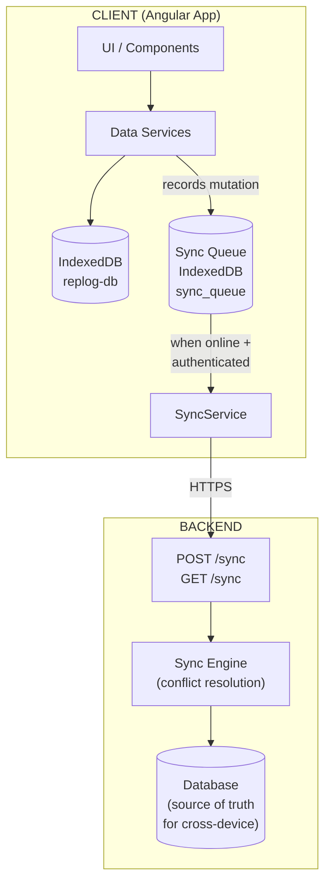

### Component Responsibilities

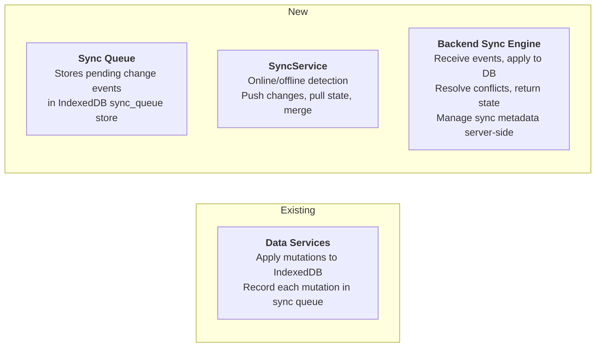

---

## 3. Change Log (Sync Queue)

### 3.1 SyncChange Type

```typescript
type SyncChangeAction = 'CREATE' | 'UPDATE' | 'DELETE';

type SyncEntityType = 'workout' | 'muscleGroup' | 'exercise' | 'log';

type SyncChange = {
  id: string;                // unique ID for this change event (crypto.randomUUID())
  entityType: SyncEntityType;
  action: SyncChangeAction;
  timestamp: string;         // ISO 8601 — when the change was made on the client
  data: Record<string, unknown>; // entity fields — always includes entity id + parent chain IDs for child entities
};
```

### 3.2 Storage

The sync queue is stored in the `sync_queue` object store in IndexedDB (`replog-db`), keyed by the change `id`.

### 3.3 Queue Operations

```typescript
// SyncQueueService (new)

class SyncQueueService {
  private readonly QUEUE_KEY = 'replog_sync_queue';

  /** Append a change to the queue */
  enqueue(change: SyncChange): void;

  /** Get all pending changes (ordered by timestamp) */
  getAll(): SyncChange[];

  /** Remove changes that have been acknowledged by the server */
  dequeue(changeIds: string[]): void;

  /** Clear the entire queue (used after full sync) */
  clear(): void;
}
```

### 3.4 What Each Service Records

#### WorkoutDataService

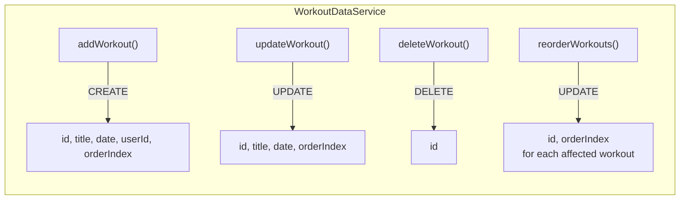

#### MuscleGroupService

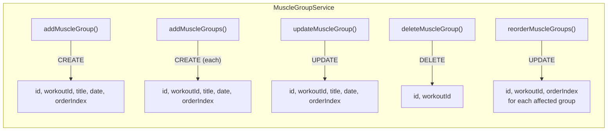

#### ExerciseService

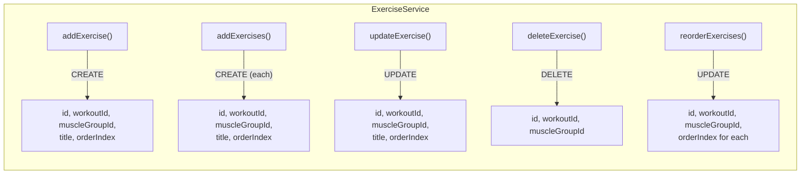

#### LogService

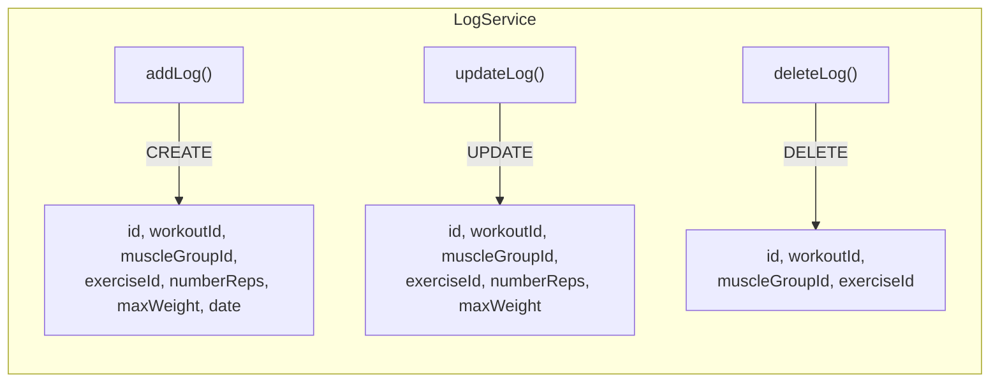

### 3.5 Example Queue

After a user creates a workout, adds a muscle group, and deletes an exercise while offline:

```json
[
  {
    "id": "c1a2b3c4-...",
    "entityType": "workout",
    "action": "CREATE",
    "timestamp": "2026-02-25T10:00:00.000Z",
    "data": {
      "id": "w-uuid-1",
      "title": "Push Day",
      "date": "2026-02-25",
      "userId": "user-123",
      "orderIndex": 0
    }
  },
  {
    "id": "d4e5f6a7-...",
    "entityType": "muscleGroup",
    "action": "CREATE",
    "timestamp": "2026-02-25T10:01:00.000Z",
    "data": {
      "id": "mg-uuid-1",
      "workoutId": "w-uuid-1",
      "title": "Chest",
      "date": "2026-02-25",
      "orderIndex": 0
    }
  },
  {
    "id": "e8f9a0b1-...",
    "entityType": "exercise",
    "action": "DELETE",
    "timestamp": "2026-02-25T10:02:00.000Z",
    "data": {
      "id": "ex-uuid-old",
      "workoutId": "w-uuid-1",
      "muscleGroupId": "mg-uuid-2"
    }
  }
]
```

---

## 4. Sync Service (Frontend)

### 4.1 SyncService Responsibilities

```typescript
class SyncService {
  // --- State ---
  readonly syncStatus: Signal<'idle' | 'syncing' | 'error' | 'offline'>;
  readonly lastSyncedAt: Signal<string | null>;

  // --- Core Methods ---

  /** Called on app init + when online status changes */
  initialize(): void;

  /** Push local changes to server, then pull all server data */
  sync(): Promise<SyncResult>;

  /** Check if there are pending changes */
  hasPendingChanges(): boolean;
}
```

### 4.2 Online/Offline Detection

```typescript
// In SyncService.initialize()
window.addEventListener('online', () => this.onOnline());
window.addEventListener('offline', () => this.onOffline());

// Also check on app startup
if (navigator.onLine && this.authService.isAuthenticated()) {
  this.sync();
}
```

### 4.3 Sync Trigger Points

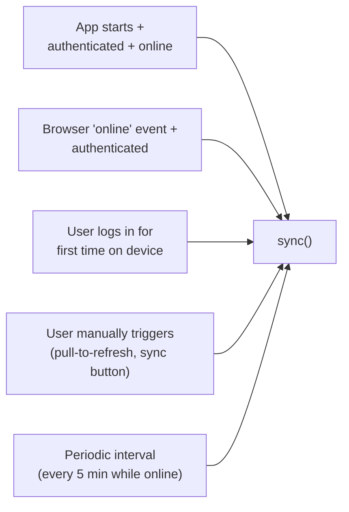

### 4.4 Sync Lock

Only one sync operation can run at a time. Use a simple boolean flag:

```typescript
private syncing = false;

async sync(): Promise<SyncResult> {
  if (this.syncing) return { status: 'already_syncing' };
  this.syncing = true;
  try {
    // ... sync logic
  } finally {
    this.syncing = false;
  }
}
```

---

## 5. Backend API Contract

### 5.1 Authentication

All sync endpoints require a valid auth token (JWT or session). The `userId` comes from the authenticated session, never from the client payload.

### 5.2 Endpoints

#### `POST /api/sync/push`

Pushes local changes to the server.

**Request:**

```json
{
  "changes": [
    {
      "id": "change-uuid",
      "entityType": "workout",
      "action": "CREATE",
      "timestamp": "2026-02-25T10:00:00.000Z",
      "data": {
        "id": "entity-uuid",
        "title": "Push Day",
        "date": "2026-02-25",
        "userId": "user-123",
        "orderIndex": 0
      }
    }
  ],
  "lastSyncedAt": "2026-02-24T20:00:00.000Z"
}
```

**Response (200 OK):**

```json
{
  "acknowledgedChangeIds": ["change-uuid-1", "change-uuid-2"],
  "conflicts": [
    {
      "changeId": "change-uuid-3",
      "resolution": "server_wins",
      "serverVersion": { "...entity fields..." }
    }
  ],
  "serverTimestamp": "2026-02-25T10:05:00.000Z"
}
```

**Response (409 Conflict — full re-sync needed):**

```json
{
  "error": "full_sync_required",
  "message": "Server state has diverged too much. Perform a full sync."
}
```

#### `GET /api/sync/pull`

Returns all workouts for the authenticated user as `WorkOutGroup[]`. The server always returns the full dataset — no incremental sync.

**Response (200 OK):**

```json
{
  "workouts": [
    {
      "id": "w-uuid",
      "title": "Push Day",
      "date": "2026-02-25",
      "userId": "user-123",
      "orderIndex": 0,
      "muscleGroup": [
        {
          "id": "mg-uuid",
          "workoutId": "w-uuid",
          "title": "Chest",
          "date": "2026-02-25",
          "orderIndex": 0,
          "exercises": [
            {
              "id": "ex-uuid",
              "muscleGroupId": "mg-uuid",
              "title": "Bench Press",
              "orderIndex": 0,
              "log": [
                {
                  "id": "log-uuid",
                  "numberReps": 10,
                  "maxWeight": 80,
                  "date": "2026-02-25T10:00:00.000Z"
                }
              ]
            }
          ]
        }
      ]
    }
  ],
  "serverTimestamp": "2026-02-25T12:00:00.000Z"
}
```

The `workouts` array matches the existing `WorkOutGroup[]` structure, so the client can merge it directly into IndexedDB without transformation. If an entity was deleted on the server, it simply won't appear in the response — the client removes any local entities not present in the server data.

### 5.3 Entity Sync Operations (Backend Processing)

For full details on how the backend processes entity changes (data model, entity processing logic, conflict resolution rules, and payload examples), see [backend-api.md](backend-api.md) — Sections 2, 4, and 5.

---

## 6. Conflict Resolution

### 6.1 Client Handling of Conflict Responses

When the server returns conflicts:

```typescript
for (const conflict of response.conflicts) {
  if (conflict.resolution === 'server_wins') {
    // Replace local entity with server version
    this.applyServerVersion(conflict.serverVersion);
  }
}
```

No user-facing conflict resolution UI is needed. Since this is a single-user app, conflicts are rare and last-write-wins is sufficient.

---

## 7. Sync Flows

### 7.1 Normal Sync (push + pull)

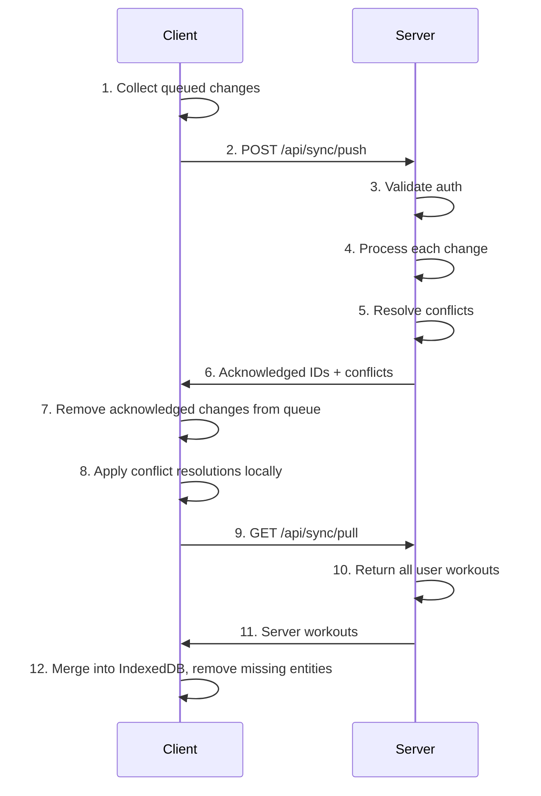

### 7.2 First Login on a New Device

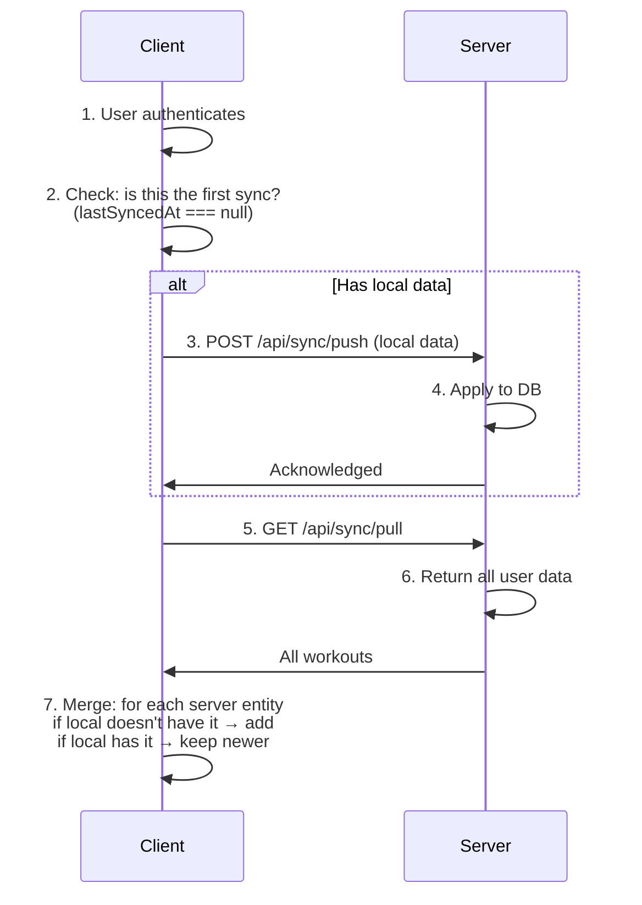

### 7.3 User Signs Up (new account, has local data)

```
1. User creates account and authenticates via Google Auth.
2. The app detects lastSyncedAt === null (first sync).
3. All existing local workouts with userId.startsWith('temp-user-')
   are updated to use the authenticated Google userId.
4. The app pushes all local data as CREATE changes.
5. Server stores everything.
6. lastSyncedAt is set.
7. From now on, normal sync flow applies.
```

### 7.4 User Logs In (existing account, device has no data)

```
1. User logs in on a new/empty device.
2. The app detects lastSyncedAt === null and no local data.
3. GET /api/sync/pull pulls everything.
4. Local storage is populated with server data.
5. lastSyncedAt is set.
```

### 7.5 User Logs In (existing account, device has anonymous local data)

```
1. User logs in. The device has local workouts with
   userId.startsWith('temp-user-').
2. Since this is a single-user personal app, always merge:
   - Replace temp-user-* userIds with the authenticated userId.
   - Push local data, then pull from server.
   - Merge by entity ID: if same ID exists on both sides,
     keep the one with the later timestamp.
3. Normal sync resumes.
```

Note: A "merge or discard?" prompt is unnecessary for a personal workout app.
All local data belongs to the user logging in.

---

## 8. Edge Cases

### 8.1 Ordering (Reorder Operations)

Currently, ordering is implicit (array index position). For sync to work with reordering, an `orderIndex` field must be added to entities that support reordering.

```typescript
type WorkOutGroup = {
  // ...existing fields
  orderIndex: number; // NEW — position in the list
};
```

When a reorder happens, update `orderIndex` on all affected entities and record each as an `UPDATE` change.

### 8.2 Cascading Deletes

When a workout is deleted, all its muscle groups, exercises, and logs must also be deleted.

**Frontend behavior:**

- When `deleteWorkout()` is called, remove the workout from IndexedDB as usual.
- Enqueue a single `DELETE` change for the workout. The backend is responsible for cascading.

**Backend behavior:**

- When a workout `DELETE` is received, the backend sets `deletedAt` on the workout and all child entities (muscle groups, exercises, logs) in the database.

### 8.3 Soft Deletes

The client does **not** track soft deletes. Deletions on the client remove records from IndexedDB immediately (UI stays clean). The sync queue records a `DELETE` change with the entity ID and timestamp, which is enough for the backend to know what was deleted.

The backend manages `deletedAt` timestamps server-side. On pull, deleted entities are excluded from the response — the client removes any local entities not present in the server data.

### 8.4 Orphaned Children

If the client sends a `CREATE` for a muscle group whose parent workout doesn't exist on the server:

- The backend rejects the change and returns it as a conflict.
- The client should ensure parent entities are pushed before children (changes are ordered by timestamp, which naturally handles this since parents are created before children).

### 8.5 Clock Skew

Client clocks may not be perfectly synchronized. Mitigation:

- The backend records its own `receivedAt` timestamp for each change.
- For conflict resolution, the backend uses client `timestamp` as a tiebreaker but trusts its own ordering for the sequence of operations.
- Keep conflict resolution simple (last-write-wins) so minor clock differences don't cause issues.

### 8.6 Large Payloads

If a user has hundreds of workouts, the full sync payload could be large.

- Paginate `GET /api/sync/pull` if needed (e.g., 50 workouts per page).
- For `POST /api/sync/push`, batch changes (e.g., max 100 changes per request).

### 8.7 Failed Sync (Network Error Mid-Sync)

- The push endpoint should be **idempotent**. Each change has a unique `id`. If the same change is pushed twice, the server ignores the duplicate.
- If the push succeeds but the pull fails, `lastSyncedAt` is NOT updated. The next sync will re-pull.
- The queue is only cleared after the server acknowledges the changes.

### 8.8 IndexedDB Storage

IndexedDB has much higher limits than localStorage (typically 50%+ of disk space), but the sync queue still adds to storage usage.

- Keep the sync queue lean — remove acknowledged changes immediately.
- If quota is exceeded, notify the user and suggest syncing.

---

## 9. Migration Plan

### 9.1 Phase 1 — Sync Queue (no backend needed)

1. Add `sync_queue` and `sync_meta` object stores to IndexedDB (increment DB version).
2. Create `SyncQueueService`.
3. Add `orderIndex` field to `WorkOutGroup`, `MuscleGroup`, and `Exercise` models.
4. Integrate `SyncQueueService` into all data services — every mutation enqueues a change.
5. The queue simply accumulates. Nothing consumes it yet.

### 9.2 Phase 2 — Authentication

1. Add authentication (login/signup).
2. Store the auth token.
3. Ensure `userId` is set on workouts from the authenticated user.

### 9.3 Phase 3 — SyncService + Backend

1. Build the backend sync endpoints (`POST /api/sync/push`, `GET /api/sync/pull`).
2. Backend manages sync metadata (`createdAt`, `updatedAt`, `deletedAt`) for all entities.
3. Implement `SyncService` on the frontend.
4. Wire up online/offline detection and sync triggers.
5. Implement the merge logic for `pull` responses (merge `WorkOutGroup[]` into IndexedDB, remove entities not present in server data).
6. Add UI indicators for sync status (syncing, last synced, pending changes, error).

### 9.4 Phase 4 — Polish

1. Add a manual "Sync Now" button.
2. Handle the "local data + new login" merge flow (userId migration from `temp-user-*`).
3. Add periodic background sync.
4. Implement sync error recovery and retry with exponential backoff.

---

## 10. Security Considerations

### 10.1 Authentication

- All sync endpoints require a valid auth token.
- The backend extracts `userId` from the token — the client never controls which user's data is accessed.

### 10.2 Authorization

- The backend must verify that every entity in a push request belongs to the authenticated user.
- A user can only pull their own data.

### 10.3 Data Validation

- The backend must validate all incoming data (types, required fields, string lengths).
- Reject changes with entity types or fields that don't match the schema.
- Sanitize text fields (titles) to prevent XSS if the data is ever rendered elsewhere.

### 10.4 Transport Security

- All sync communication must use HTTPS.
- Auth tokens should be stored securely (HttpOnly cookies or secure storage on native, in-memory on web).

### 10.5 Rate Limiting

- Rate-limit the sync endpoints to prevent abuse.
- Suggested: max 10 sync requests per minute per user.

---

## Appendix A: IndexedDB Schema

**Database:** `replog-db`

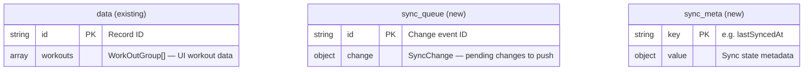

**Separate storage (unchanged):**

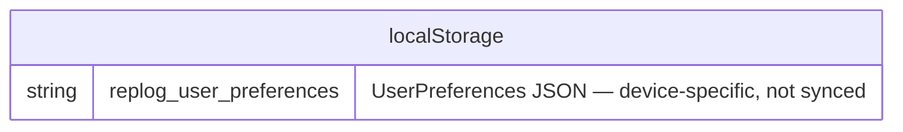

## Appendix B: New TypeScript Types (Summary)

Sync types live in `src/app/models/sync/`. UI models in `src/app/models/` are unchanged (except for the addition of `orderIndex`).

```typescript
// --- src/app/models/sync/sync-change.ts ---

type SyncChangeAction = 'CREATE' | 'UPDATE' | 'DELETE';

type SyncEntityType = 'workout' | 'muscleGroup' | 'exercise' | 'log';

type SyncChange = {
  id: string;
  entityType: SyncEntityType;
  action: SyncChangeAction;
  timestamp: string;
  data: Record<string, unknown>;
};

// --- src/app/models/sync/sync-api.ts ---

type PushRequest = {
  changes: SyncChange[];
  lastSyncedAt: string | null;
};

type PushResponse = {
  acknowledgedChangeIds: string[];
  conflicts: SyncConflict[];
  serverTimestamp: string;
};

type SyncConflict = {
  changeId: string;
  resolution: 'server_wins';
  serverVersion: Record<string, unknown>;
};

type PullResponse = {
  workouts: WorkOutGroup[];
  serverTimestamp: string;
};

type SyncStatus = 'idle' | 'syncing' | 'error' | 'offline';

type SyncResult =
  | { status: 'success'; pushed: number; pulled: number }
  | { status: 'already_syncing' }
  | { status: 'not_authenticated' }
  | { status: 'offline' }
  | { status: 'error'; message: string };
```

## Appendix C: Sync Status UI Indicators

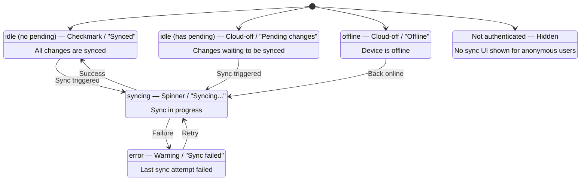
